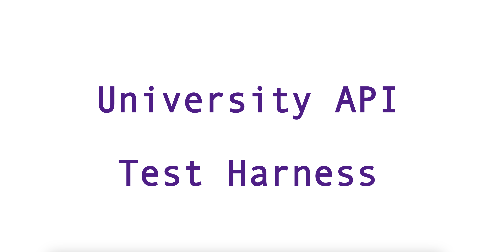
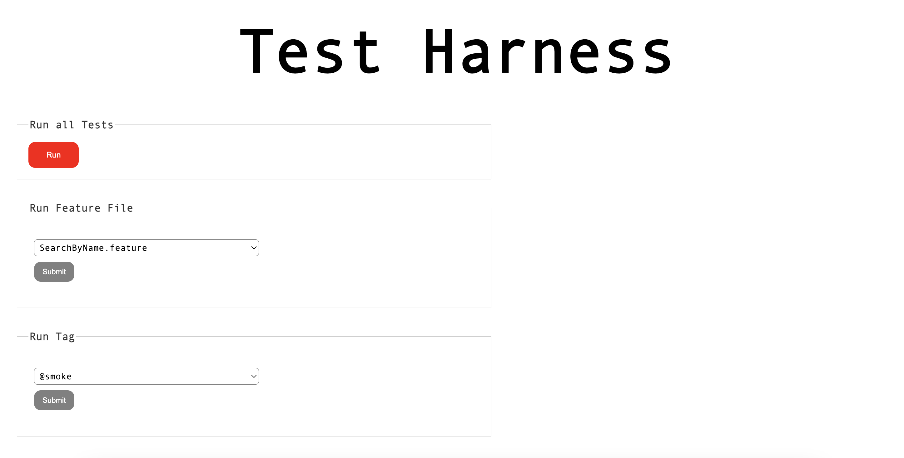
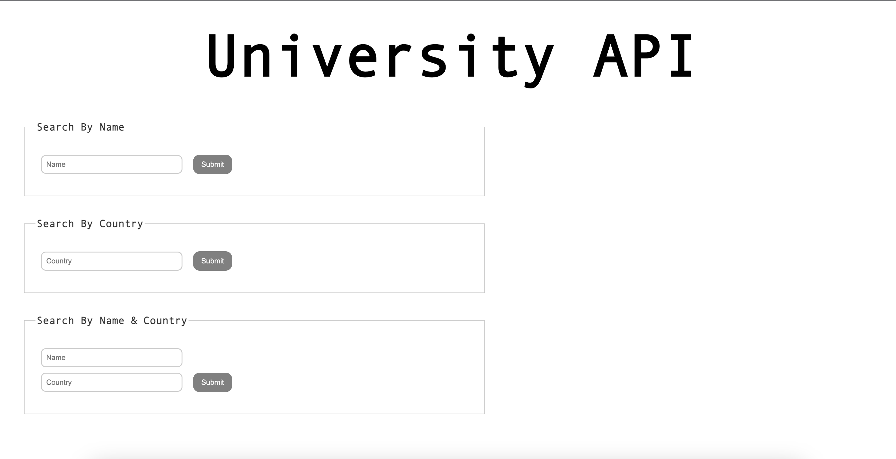
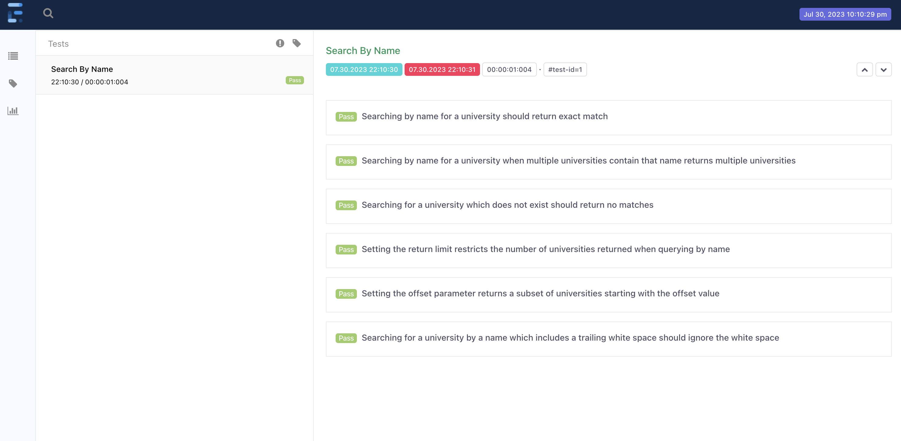

<h1 align="center">Spring Boot and Cucumber</h1>
<h3 align="center">Automated Cucumber Tests with a Spring Boot Test Harness</h3>

### 

### Tools
* Java
* Maven
* Cucumber
* Spring Boot
* Unirest

### How to Run the Spring Boot application
```shell
mvn clean install
```

Once the Spring Boot app is up and running, you can navigate to http://locaihost:8081


### Spring Boot App
The Spring Boot app provides two key capabilities, these are;
* Sending requests to the University API
* Execute the Cucumber tests

##### University API
More information on the University API can be found here: https://github.com/Hipo/university-domains-list-api 

##### Executing Cucumber Tests
The test harness capability lets you execute the Cucumber tests. The options are;
* Run all tests
* Run tests in a given feature file
* Run tests with a given tag


### Screenshots
<p >
  
</p>
<p>
  
</p>
<p>
  
</p>
<p>
  
</p>